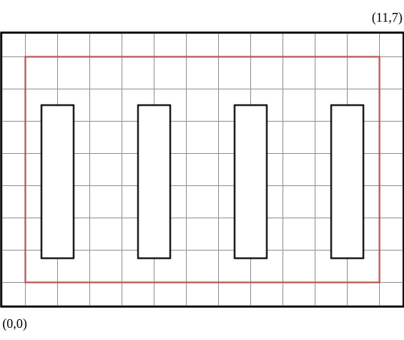
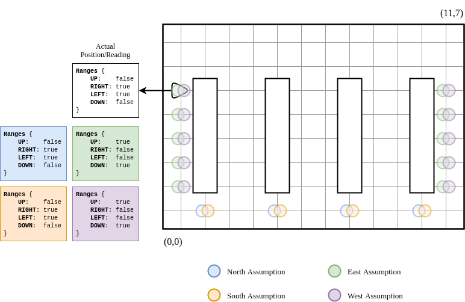
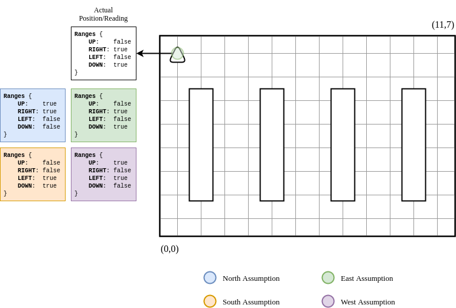

# Localisation

## Usage

An instance of the `Localisation` class is needed. From there, the `Localisation.getPosition()` method can be called, which will run for a somewhat extended period of time. Once the robots are learnt their positions in the warehouse, the `RobotLocation` representation of the robot will be returned. For example:

```java
Localisation local = new Localiser(new Communication(ID, name, this), new ArrayList<>());
RobotLocation location = local.getLocation();
```

## Approach

The `Localisation` interface has a method `Localisation.getPosition()`, which returns a `RobotLocation` representing the estimated location of the robot.

In order to establish the position of the robot, the current approach for the localisation implementation will record ranges in blocks of 1 range - i.e. booleans determining whether it is possible to move in a given direction - storing the possible positions by comparing the ranges against the stored map of the warehouse. The robot will move, record the ranges again and remove any points from the current possible positions by seeing which ones would be possible to exist given the previous position and the movement of which has just occurred.

This process will repeat continuously until there is only 1 possible position to exist, or until a set threshold of repetitions has been met.

As the initial heading is unknown, all of the possible positions have to be calculated 4 times simultaneously. This is done so that the robot can assume its heading as all 4 directions until it finds one of which is correct - 1 position found. This process is aided by the `LocaliserAssumption` class, which essentially stores an individual list of possible points, the assumed starting heading, and the current heading based on the assumed starting one. All of this information is then used to return the `RobotLocation` of the robot once it has filtered the positions down to a final one.

Rather than basing the localisation on probability, this approach is based on certainty - it is certain about its final location or not at all. This is because it only relies on the range sensor looking for a range 1 grid space away, which is reliable. Making use of this certainty ensures that the entire localisation process is robust and works well.

## Generating Ranges

Initialising a `Localisation` class generates an `ArrayList<Point> blockedPoints` using the `Warehouse.getBlockedLocations()` method.

For the localisation to work, the ranges recorded at every point need to be generated beforehand so that the ranges recorded from the robot can be looked up and matched against the known map.

To do this, a `GridMap world` is stored in the class, using the `Warehouse.build()` method to populate it. This GridMap can be visualised as the following:



The red rectangle signifies the bounds of the co-ordinates, meaning that the lower left corner of the red rectangle is (0,0) and the upper right corner is (11,7).

This then allows for the `world.getXSize()` and `world.getYSize()` methods to be used to get the max X and Y co-ordinates of the world, which can then be used within a for loop to iterate over all of the co-ordinates:

```java
for (int x = 0; x < world.getXSize(); x++) {
	for (int y = 0; y < world.getYSize(); y++) {
		// Do stuff...
	}
}
```

At the start of the iteration of the inner loop, a `Point point = new Point(x, y)` is created. This is then checked to see whether it is **not** contained within `blockedPoints` before proceeding.

The up, right, down and left ranges are then taken using a heading of 90, 0, -90 and 180 respectively, using the method `world.rangeToObstacleFromGridPosition(x, y, heading)`.

These are then used to create a `Ranges ranges = new Ranges(up, right, down, left, Ranges.virtualConverter)`, which is then used in the following to map the ranges to the given point:

```java
warehouseMap.put(ranges, point);
```

Running this will result in what is visualsied in the following diagram:


Although only three points have been annotated here, each translucent point also has a Ranges object generated for it.

### Converters

There are two types of converters used for localisation, **virtual** and **physical**. These are used to convert the ranges in the simulated and real worlds repsectively.

```
rawRanges -> converter -> Ranges object
```

## Filtering

When a new set of ranges has been recorded, `next`, the previous set of ranges `initial` is compared to see which points could still be feasible given the change in location from `initial` to `next`. This change in location is stored as a `Point change`, and is one of the following:

|UP|RIGHT|DOWN|LEFT|
|--|--|--|--|
|`new Point(0, 1)`|`new Point(1, 0)`|`new Point(0, -1)`|`new Point(-1, 0)`|

On top of this, all points in `next` are checked to see if they are contained within `blockedPoints` so that only possible locations are kept within the list of points.

The line responsible for this filtering is the following:

```java
next.removeIf(p -> !initial.contains(p.subtract(change)) || blockedPoints.contains(p));
```


## Run-Through Example

Starting the localisation process with the robot facing **EAST** at position **(0,5)**, the following possible positions are discovered:



In the diagram, the different assumptions are colour coded. These assumptions assume that the first reading was taken with the robot facing in this direction, therefore in this case, the correct ones to follow are the **EAST** assumptions (green). The `LocaliserAssumption` objects for each of these assumptions are responsible for rotating the ranges they receive based on their assumption of direction. Since the virtual ranges are generated north-based, they have to rotate the ranges so that they are also north-based according to their assumptions, hence why there are different values in the colour coded ranges.

The available directions to travel in are either **1** or **3**, representing **RIGHT** or **LEFT**. When **0 (FORWARDS)** is **not** present, a direction is chosen at random, in this case, **3 (LEFT)** is chosen:


After this movement, the ranges are taken again, then filtered for each assumption. As can be shown from the diagram above, the west and south assumptions do not contain any possible locations and east contains **1**; however, to ensure correctness, localisation should continue to run until the total number of possible points across all assumptions is **1**. In the next iteration of localisation, the available directions are **0** and **1 (FORWARD or RIGHT)**, since **0** is available, it chooses this:



Now once the ranges at this location are analysed, the north assumption has lost its possible locations and the only assumption to contain any points is the east assumption. Since the east assumption only has one possible location, localisation is complete, therefore the location and direction is returned. After each rotation, the direction is updated in the assumptions, meaning that the direction returned is the actual direction of which the robot is facing.